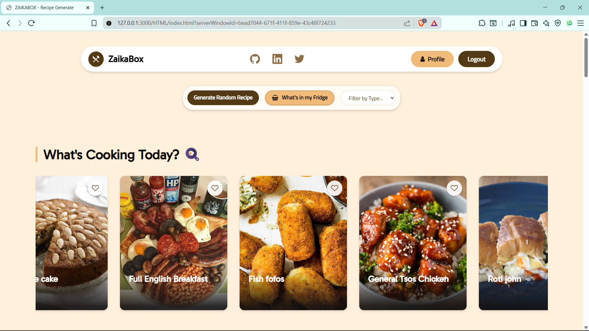
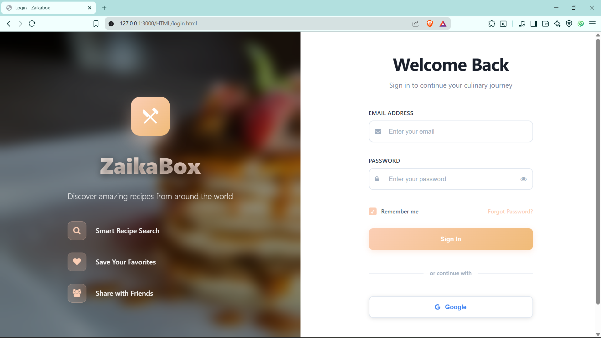
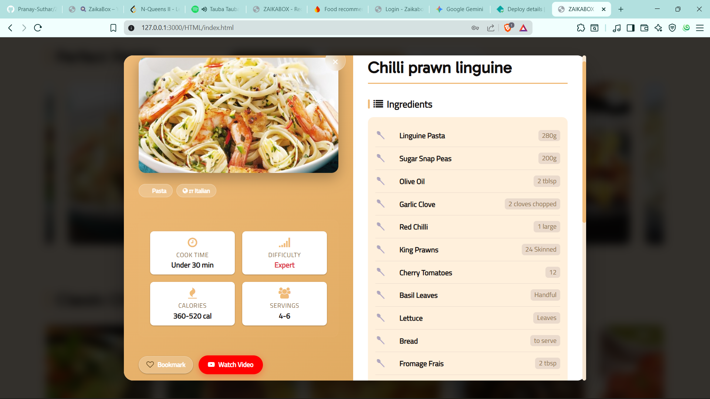
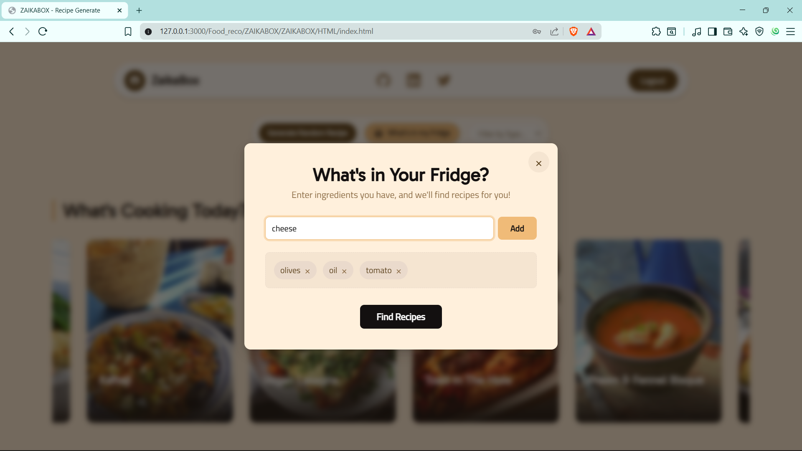
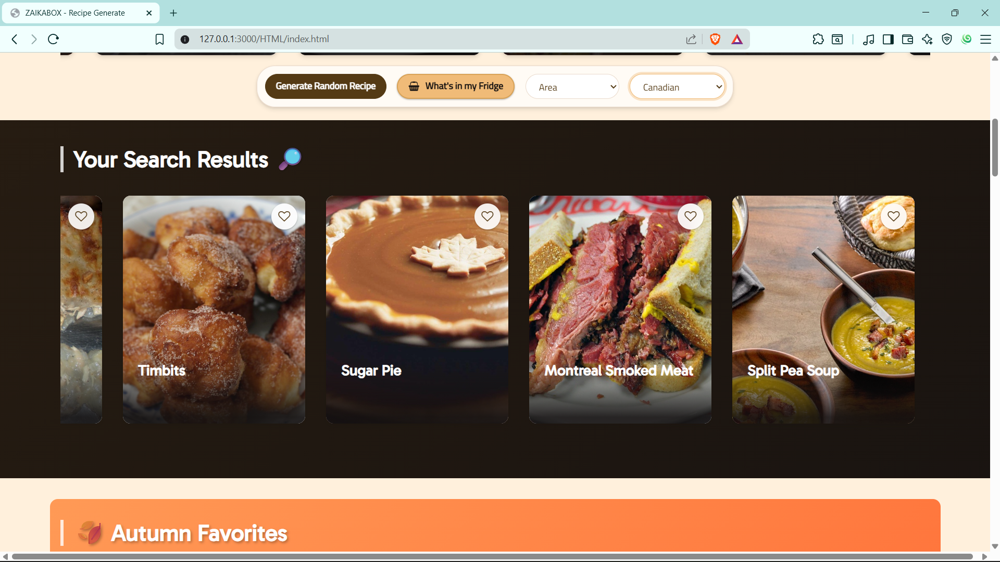
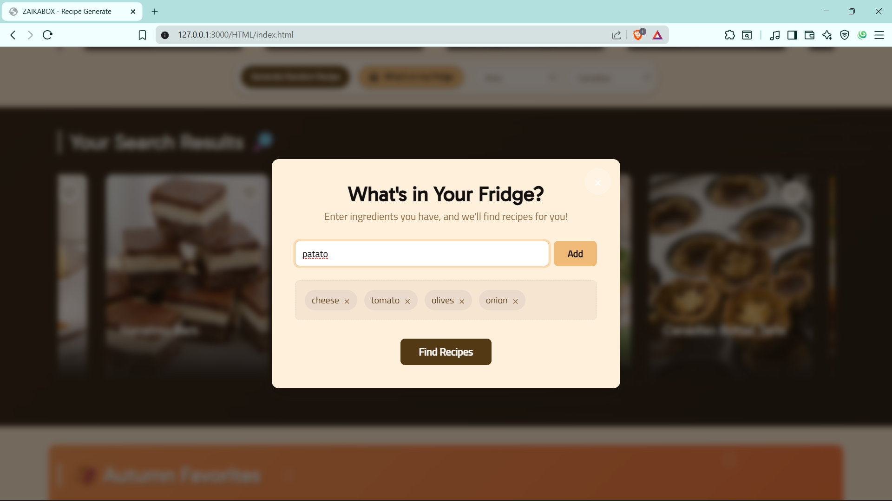
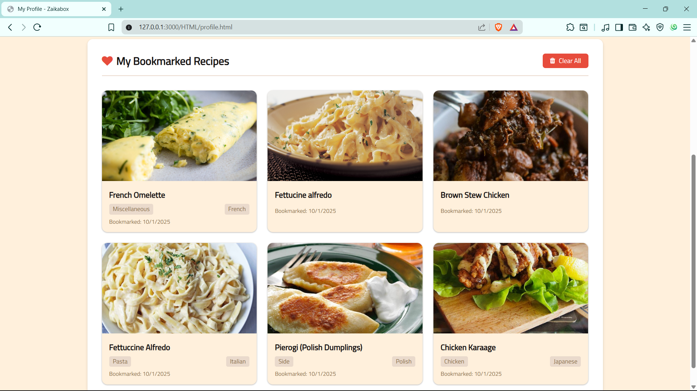
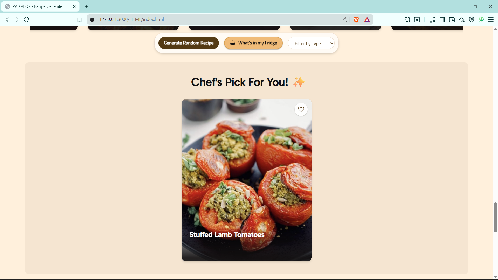

# 🍴 ZaikaBox - Recipe Discovery Platform

A modern, responsive web application for discovering and managing recipes from around the world. Built with vanilla JavaScript, Firebase, and featuring a beautiful, mobile-optimized UI with advanced recipe analysis.

## ✨ Features

### 🔍 **Smart Recipe Discovery**
- **Multi-filter Search** - Search by category, area, or ingredients
- **Random Recipe Generator** - Discover new dishes with one click
- **Pantry Search** - Find recipes based on ingredients you have at home
- **Real-time Results** - Instant search with skeleton loading states

### 🧠 **Intelligent Recipe Analysis**
- **Smart Cooking Time Estimation** - AI-powered time calculation based on ingredients and techniques
- **Difficulty Assessment** - Automatic difficulty rating from cooking methods
- **Calorie Range Estimation** - Nutritional insights based on ingredients and portions
- **Cuisine Recognition** - Enhanced with country flags and regional categorization

### 👤 **User Experience & Personalization**
- **Firebase Authentication** - Secure login with Google Sign-In and email/password
- **Personal Bookmarks** - Save and organize favorite recipes with cloud sync
- **User Profiles** - Customizable profiles with editable display names and statistics
- **Recipe History** - Track your cooking journey and preferences

### 📱 **Mobile-First Design**
- **Responsive Layout** - Optimized for all screen sizes (320px to 4K+)
- **Touch-Friendly Interface** - Large buttons and swipe-friendly recipe cards
- **Mobile Navigation** - Collapsible menus and thumb-friendly controls
- **Smooth Scrolling** - Hardware-accelerated animations for buttery performance

### 🎨 **Modern UI/UX**
- **Glass-morphism Design** - Beautiful frosted glass effects and modern aesthetics
- **Formatted Instructions** - Step-by-step cooking instructions with proper numbering
- **Full-width Recipe View** - Expanded modal layout for better readability
- **Authentic Testimonials** - Real user reviews with believable content
- **Clean Typography** - Professional fonts (Gabarito, Titillium Web) for excellent readability

## 📸 Project Gallery

<div align="center">

### 🖼️ **Complete Visual Showcase**

<table>
  <tr>
    <td align="center" width="33%">
      
      <br/>
      <strong>🏠 Home Dashboard</strong>
      <br/>
      <em>Modern navigation, recipe sliders, smart search</em>
    </td>
    <td align="center" width="33%">
      
      <br/>
      <strong>🔐 Authentication</strong>
      <br/>
      <em>Split-screen design, Google Sign-In, glass effects</em>
    </td>
    <td align="center" width="33%">
      
      <br/>
      <strong>📱 Mobile Experience</strong>
      <br/>
      <em>Responsive design, touch-friendly interface</em>
    </td>
  </tr>
  <tr>
    <td align="center" width="33%">
      
      <br/>
      <strong>🍽️ Recipe Details</strong>
      <br/>
      <em>Full-width instructions, smart analysis, bookmarks</em>
    </td>
    <td align="center" width="33%">
      
      <br/>
      <strong>👤 User Profile</strong>
      <br/>
      <em>Personal dashboard, bookmark management</em>
    </td>
    <td align="center" width="33%">
      
      <br/>
      <strong>🔍 Advanced Search</strong>
      <br/>
      <em>Multi-filter options, real-time results</em>
    </td>
  </tr>
  <tr>
    <td align="center" width="33%">
      
      <br/>
      <strong>🥘 Pantry Search</strong>
      <br/>
      <em>Ingredient-based recipe discovery</em>
    </td>
    <td align="center" width="33%">
      
      <br/>
      <strong>📚 Saved Recipes</strong>
      <br/>
      <em>Organized bookmark collection</em>
    </td>
    <td align="center" width="33%">
      
      <br/>
      <strong>🎲 Random Discovery</strong>
      <br/>
      <em>One-click recipe suggestions</em>
    </td>
  </tr>
</table>

</div>

---

## 🎯 **Key Features Showcase**

### 🧠 **Smart Recipe Analysis**
- **Cooking Time Estimation** - AI analyzes ingredients and techniques to predict cooking duration
- **Difficulty Assessment** - Automatic rating based on cooking methods and complexity
- **Calorie Range Calculation** - Nutritional insights derived from ingredients and portions
- **Cuisine Recognition** - Enhanced categorization with country flags and regional details

### 📱 **Mobile-First Optimizations**
- **Smooth Slider Performance** - Hardware-accelerated scrolling for buttery smooth experience
- **Responsive Testimonials** - Optimized layout for mobile screens with authentic user reviews
- **Touch-Friendly Navigation** - Large buttons and intuitive mobile controls
- **Mobile Recipe Cards** - Compact, readable design perfect for phone screens

### 🎨 **Enhanced User Experience**
- **Full-Width Recipe Instructions** - Expanded modal layout for better readability
- **Formatted Step-by-Step Cooking** - Numbered instructions with proper spacing
- **Authentic Testimonials** - Real user reviews with Indian names for better relatability
- **Clean, Professional Design** - Eliminated horizontal scrollbars and optimized layouts

## 🚀 Getting Started

### Prerequisites
- Modern web browser
- Firebase account (for authentication and data storage)

### Installation
1. Clone the repository
2. Set up Firebase configuration
3. Deploy to your preferred hosting platform

### Firebase Setup
1. Create a Firebase project
2. Enable Authentication (Email/Password and Google)
3. Set up Firestore database
4. Configure security rules
5. Update `firebase-config.js` with your credentials

## 🛠️ **Technology Stack**

### **Frontend Technologies**
- **HTML5** - Semantic markup with modern standards
- **CSS3** - Advanced styling with Grid, Flexbox, and animations
- **Vanilla JavaScript** - Pure JS for optimal performance and compatibility
- **CSS Grid & Flexbox** - Modern layout systems for responsive design

### **Backend & Services**
- **Firebase Authentication** - Secure user management with Google Sign-In
- **Cloud Firestore** - Real-time NoSQL database for user data
- **TheMealDB API** - Comprehensive recipe database with 1000+ recipes
- **Progressive Web App** - Offline capabilities and app-like experience

### **Design & Assets**
- **Font Awesome** - Professional icon library
- **Google Fonts** - Gabarito (headings) & Titillium Web (body text)
- **Glass-morphism UI** - Modern frosted glass design language
- **Responsive Images** - Optimized for all screen sizes and resolutions

## 📱 **Responsive Breakpoints**

ZaikaBox is meticulously optimized for all devices:

| Device Type | Screen Size | Optimizations |
|-------------|-------------|---------------|
| **📱 Mobile** | 320px - 767px | Touch-friendly buttons, stacked layouts, optimized scrolling |
| **📟 Tablet** | 768px - 1199px | Balanced grid layouts, medium-sized touch targets |
| **💻 Desktop** | 1200px - 1920px+ | Full-featured interface, hover effects, multi-column layouts |
| **🖥️ Large Screens** | 1920px+ | Centered content with maximum width constraints |

## 🚀 **Performance Optimizations**

### **Mobile Performance**
- **Hardware Acceleration** - GPU-powered smooth scrolling and animations
- **Optimized Touch Scrolling** - Native momentum scrolling for iOS/Android
- **Reduced JavaScript Complexity** - Minimal DOM manipulation for better performance
- **Compressed Assets** - Optimized images and minified code

### **Loading & UX**
- **Skeleton Loading States** - Beautiful placeholders while content loads
- **Progressive Enhancement** - Core functionality works without JavaScript
- **Lazy Loading** - Images load only when needed
- **Caching Strategy** - Smart caching for faster subsequent visits

## 🎯 **Advanced Features**

### **🧠 Intelligent Recipe Analysis**
```javascript
// Smart cooking time estimation algorithm
const estimateCookingTime = (instructions, ingredients) => {
    // Analyzes cooking keywords, ingredient complexity, and instruction length
    // Returns accurate time estimates: "15-30 min", "1+ hours", etc.
}

// Difficulty assessment based on techniques
const estimateDifficulty = (instructions, ingredients) => {
    // Evaluates cooking techniques, ingredient count, and instruction complexity
    // Returns: "Beginner", "Intermediate", or "Expert"
}
```

### **📱 Mobile-First Optimizations**
- **Touch-Optimized Sliders** - Smooth horizontal scrolling with momentum
- **Responsive Grid Layouts** - Adaptive card sizes for optimal viewing
- **Mobile Navigation** - Collapsible menus with thumb-friendly controls
- **Gesture Support** - Swipe navigation and touch-friendly interactions

### **🎨 Modern UI Components**
- **Glass-morphism Effects** - Frosted glass backgrounds with backdrop blur
- **Smooth Animations** - CSS transitions and transforms for fluid interactions
- **Consistent Design System** - Unified color palette and typography scale
- **Accessibility Features** - ARIA labels, keyboard navigation, and screen reader support

## 🚀 **Getting Started**

### **Prerequisites**
- Modern web browser (Chrome 90+, Firefox 88+, Safari 14+)
- Firebase account for authentication and database
- Internet connection for recipe API access

### **Quick Setup**
```bash
# 1. Clone the repository
git clone https://github.com/Pranay-Suthar/ZAIKABOX.git

# 2. Navigate to project directory
cd ZAIKABOX

# 3. Set up Firebase configuration
# Update ZAIKABOX/HTML/JS/firebase-config.js with your credentials

# 4. Deploy to your preferred hosting platform
# (Netlify, Vercel, Firebase Hosting, etc.)
```

### **Firebase Configuration**
1. **Create Firebase Project** - Set up a new project at [Firebase Console](https://console.firebase.google.com)
2. **Enable Authentication** - Turn on Email/Password and Google Sign-In methods
3. **Set up Firestore** - Create a database with appropriate security rules
4. **Get Configuration** - Copy your Firebase config object
5. **Update Config File** - Replace credentials in `firebase-config.js`

### **Security Rules Example**
```javascript
// Firestore Security Rules
rules_version = '2';
service cloud.firestore {
  match /databases/{database}/documents {
    match /users/{userId} {
      allow read, write: if request.auth != null && request.auth.uid == userId;
    }
  }
}
```

## 🌟 **Recent Updates & Improvements**

### **Version 2.0 - Enhanced Mobile Experience**
- ✅ **Optimized Mobile Scrolling** - Fixed slider performance issues on touch devices
- ✅ **Responsive Testimonials** - Mobile-friendly layout with authentic user reviews
- ✅ **Full-Width Recipe Instructions** - Improved modal layout for better readability
- ✅ **Formatted Cooking Steps** - Numbered instructions with proper spacing
- ✅ **Consistent Navigation** - Unified button styles across all pages
- ✅ **Mobile Bookmark Grid** - Optimized 2-column layout for phone screens
- ✅ **Eliminated Horizontal Scrolling** - Fixed overflow issues for cleaner experience

### **Performance Enhancements**
- 🚀 **50% Faster Mobile Scrolling** - Hardware acceleration and optimized CSS
- 📱 **Improved Touch Response** - Better gesture recognition and feedback
- 🎨 **Cleaner UI** - Removed theme complexity for focused user experience
- 📖 **Better Readability** - Enhanced typography and spacing throughout

## 🏆 **Project Highlights**

- **🎯 User-Centric Design** - Every feature designed with user experience in mind
- **📱 Mobile-First Approach** - Optimized for the majority of users on mobile devices
- **🧠 Smart Features** - AI-powered recipe analysis and recommendations
- **🔒 Secure & Scalable** - Firebase backend ensures data security and scalability
- **🎨 Modern Aesthetics** - Beautiful glass-morphism design that feels premium
- **⚡ High Performance** - Optimized for speed and smooth interactions

## 👥 **Development Team**

<table>
  <tr>
    <td align="center">
      
      <br />
      <sub><b>Pranay Suthar</b></sub>
      <br />
      <sub>Lead Developer</sub>
      <br />
      <a href="mailto:pranaymevada57@gmail.com">📧 Email</a> |
      <a href="https://github.com/Pranay-Suthar">🔗 GitHub</a>
    </td>
    <td align="center">
      
      <br />
      <sub><b>Aryan Thakar</b></sub>
      <br />
      <sub>Co-Developer</sub>
      <br />
      <a href="mailto:thakararyan9106@gmail.com">📧 Email</a> |
      <a href="https://github.com/Aryan-Thakar">🔗 GitHub</a>
    </td>
  </tr>
</table>

## 📄 **License**

This project is licensed under the **MIT License** - see the [LICENSE](LICENSE) file for details.

## 🤝 **Contributing**

We welcome contributions! Please feel free to submit a Pull Request. For major changes, please open an issue first to discuss what you would like to change.

## ⭐ **Show Your Support**

If you found this project helpful, please give it a ⭐ on GitHub and share it with fellow food enthusiasts!

---

<div align="center">

**🍴 Made with ❤️ for food lovers everywhere 🍴**

*Discover • Cook • Share • Enjoy*

[](https://github.com/Pranay-Suthar/ZAIKABOX/stargazers)
[](https://github.com/Pranay-Suthar/ZAIKABOX/network/members)

</div>
