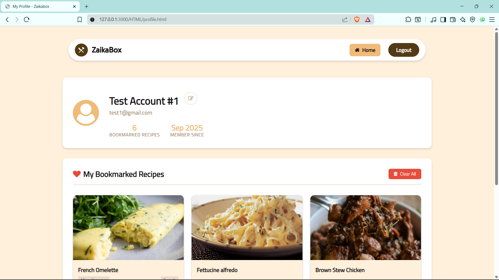
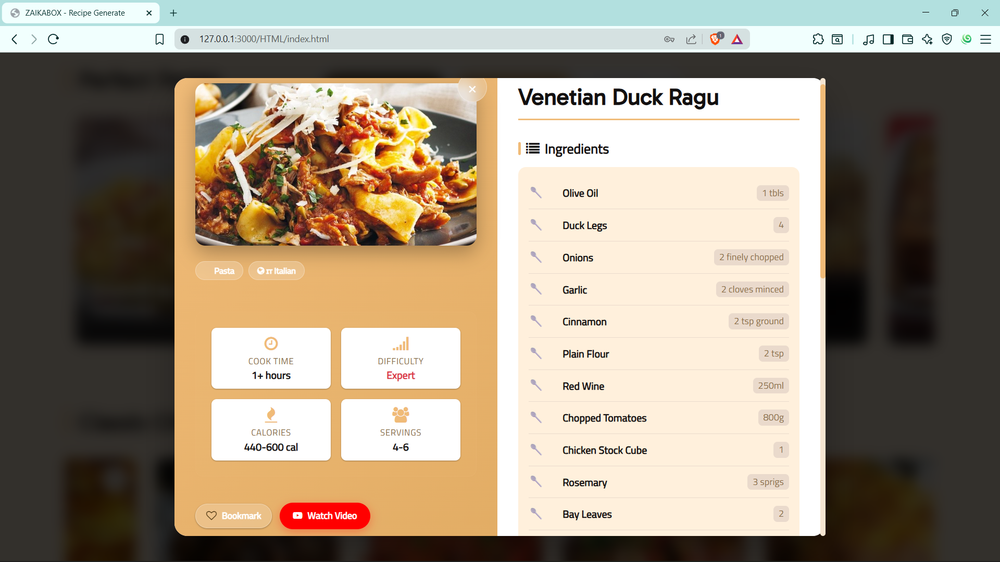

# 🍳 ZaikaBox – Your Personal Recipe Discovery App  

ZaikaBox is a sleek, modern web application designed to help you **discover thousands of exciting recipes** from around the world.  
With a clean, interactive UI and powerful search capabilities, finding your next favorite meal has never been easier!  

The app is built with **Vanilla JavaScript** and powered by **Firebase**, allowing you to securely log in, save recipes, and sync your personal cookbook in real-time.  

---

## ✨ Key Features  

### 👤 User Authentication & Personalization  
- 🔑 **Secure Sign-Up & Login** using Firebase Authentication  
- 📖 **Personal Cookbook** – save and manage your favorite recipes  
- 🔄 **Real-time Syncing** with Firebase Firestore across devices  

### 🍽️ Advanced Recipe Discovery  
- 🎲 **Generate Random Recipe** with one click  
- 🧠 **Dynamic Filtering** by:  
  - Category (e.g., Dessert, Seafood, Breakfast)  
  - Country/Area (e.g., Italian, Indian, Mexican)  
  - Main Ingredient (e.g., Chicken, Salmon, Rice)  
- 🔍 **Live Search Options** powered by TheMealDB API (always up-to-date)  

### 🖥️ Interactive & Modern UI  
- 🔎 **Floating, Expandable Search Bar** with smooth animation  
- 📑 **Detailed Recipe Modal** with ingredients, instructions & YouTube video integration  
- 🃏 **Interactive Recipe Cards** with hover-reveal & "like/save" feature  
- 📥 **Load More Pagination** for efficient browsing  
- 📱 **Fully Responsive** across desktop, tablet, and mobile  

### 🚧 (In Progress) Dedicated Cookbook Page  
A dedicated **Cookbook page** (`cookbook.html`) where users can view and manage saved recipes.  

---

## 🛠️ Tech Stack  

- **Frontend**: HTML5, CSS3 (Flexbox, Grid), Vanilla JavaScript (ES6+)  
- **Backend & Database**: Google Firebase (Authentication, Firestore)  
- **API**: [TheMealDB API](https://www.themealdb.com/) for recipe data  
- **Icons**: Font Awesome  

---

## 🚀 How to Use  

1. **Explore** → Open the app and browse trending or random recipes  
2. **Search & Filter** → Expand the floating search bar to filter by Category, Country, or Ingredient  
3. **View Recipes** → Open a recipe modal to see ingredients, instructions, and cooking video  
4. **Save Favorites** → Log in and save recipes to your personal cookbook  
5. **Cookbook (Coming Soon)** → Manage your saved recipes in one place  

---

🖼️ Photo Gallery
Here is a showcase of our project in action, featuring different screens and functionalities.

<table align="center">
<tr>
<td colspan="2" align="center">

<b>Main Dashboard</b>

</td>
<td colspan="2" align="center">

<b>Recipe Search</b>

</td>
</tr>
<tr>
<td colspan="4" align="center">

<b>Featured Recipe View</b>

</td>
</tr>
<tr>
<td align="center">

<b>Pantry Search</b>

</td>
<td align="center">

<b>Mobile View</b>

</td>
<td align="center">

<b>Testimonials</b>

</td>
<td align="center">

<b>Login Page</b>

</td>
</tr>
</table>

---

## 🤝 Contributing  

Contributions are welcome! Feel free to **fork this repo**, submit PRs, or suggest new features via issues.  

---

## 📬 Connect  

- [Pranay Suthar](https://github.com/Pranay-Suthar)  
- [Aryan Thakar](https://github.com/aryan9106)
- 🌐 Project Repo: [ZaikaBox](https://github.com/Pranay-Suthar/ZAIKABOX)  

---

⭐ If you like this project, don’t forget to **star the repo** and share it with foodies & developers!  
